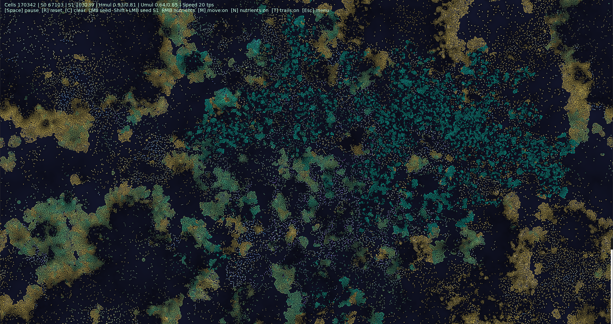

# Game of Life

An SFML toy that combines a Game-of-Life-style neighborhood rule with an energy + nutrient field (diffusion + regrowth), so patterns grow, compete, collapse, and migrate.

This version pushes beyond “random mutation” by making mutations **heritable traits** (multipliers over metabolism and reproduction), plus a small chance to mutate the **neighbor-rule window**. The environment then *selects* which traits survive and reproduce.

## Screenshot

## Controls
- Click `START` to begin
- `Space`: pause/resume
- `R`: reset (new nutrient field + seed)
- `C`: clear all life (keeps nutrients)
- `N`: toggle nutrient background
- `T`: toggle trails
- `M`: toggle movement (food-seeking)
- Left click: place a small life seed (species 0 baseline)
- Shift + left click: place a small life seed (species 1 baseline)
- Right click: add a nutrient patch
- `Esc`: back to menu
- `+` / `-`: speed up / slow down the simulation ticks
- Arrow keys: pan the viewport
- Mouse wheel: zoom in and out (clamped between 0.5x and 4x)
- `1`, `2`, `3`: spawn preset clusters and reset view

## Notes
- The grid is intentionally very fine now (`kCellSize = 2`, i.e. `1280x720` cells) for very small squares.

## Build
See `BUILDING.md`.

## Smoke test
Run `gameoflife.exe --smoke` to auto-close after a couple seconds.
